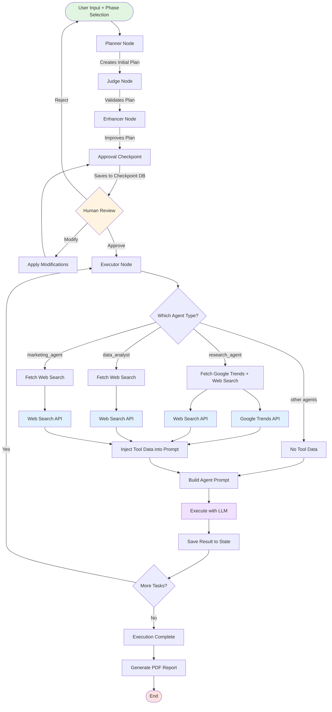
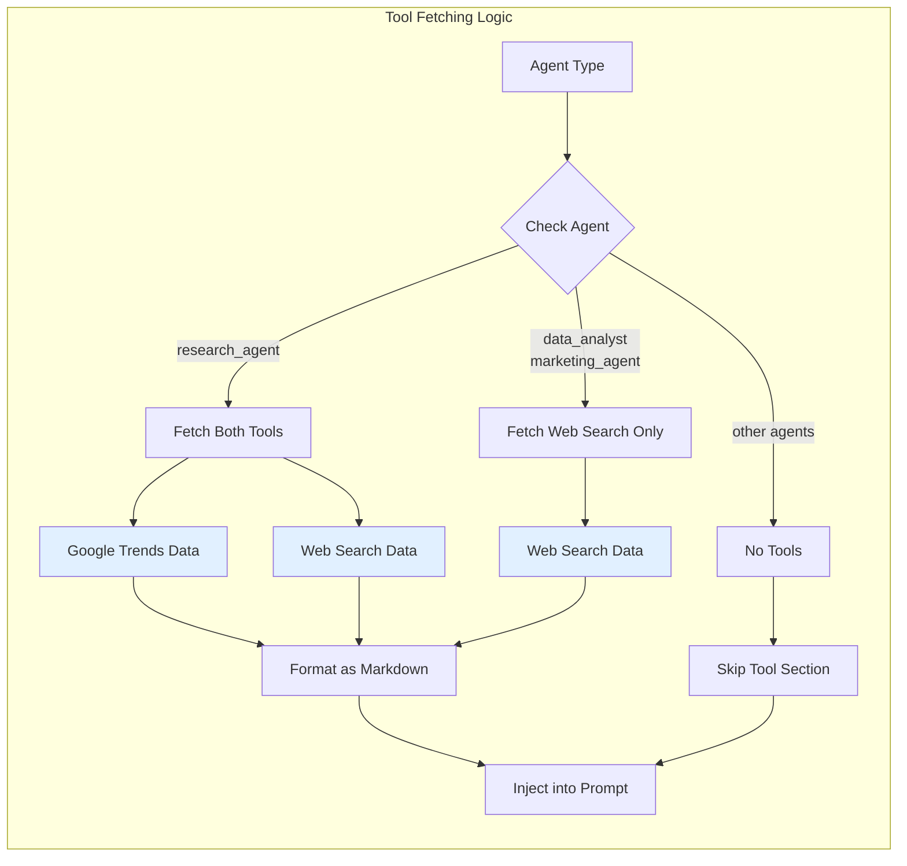
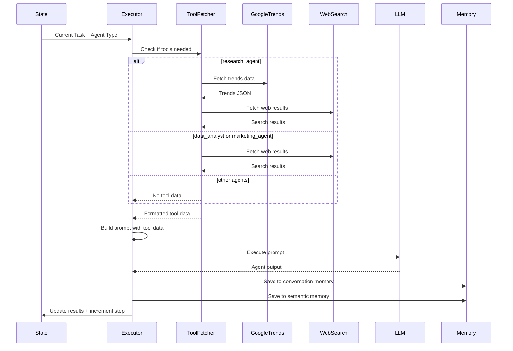
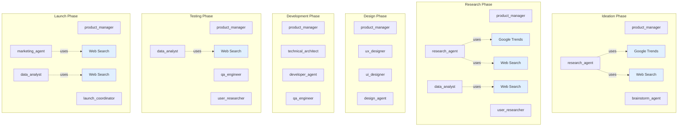
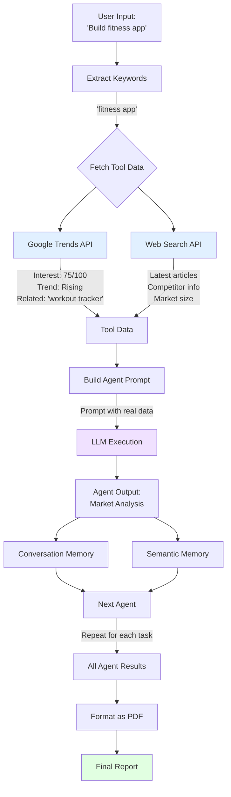

# Multi-Agent Workflow with Tool Integration

## Complete System Flowchart

## Tool Integration Detail

## Executor Node Flow with Tools

## Phase-Based Agent and Tool Availability

## Data Flow: User Input → Final Report

## Key Points

### Tool Integration Strategy
1. **Automatic Fetching**: Tools are called automatically based on agent type
2. **Data Injection**: Tool data is injected into agent prompts
3. **No Function Calling**: Agents don't "call" tools - they receive pre-fetched data
4. **Phase-Aware**: Tool availability can be restricted by development phase

### Agent-Tool Mapping
- **research_agent**: Google Trends + Web Search
- **data_analyst**: Web Search
- **marketing_agent**: Web Search
- **Other agents**: No tools (yet)

### Workflow Checkpoints
1. **After Enhancer**: State saved to SQLite
2. **Before Executor**: Human approval required
3. **After Each Task**: Results saved to memory
4. **After All Tasks**: Final report generated
